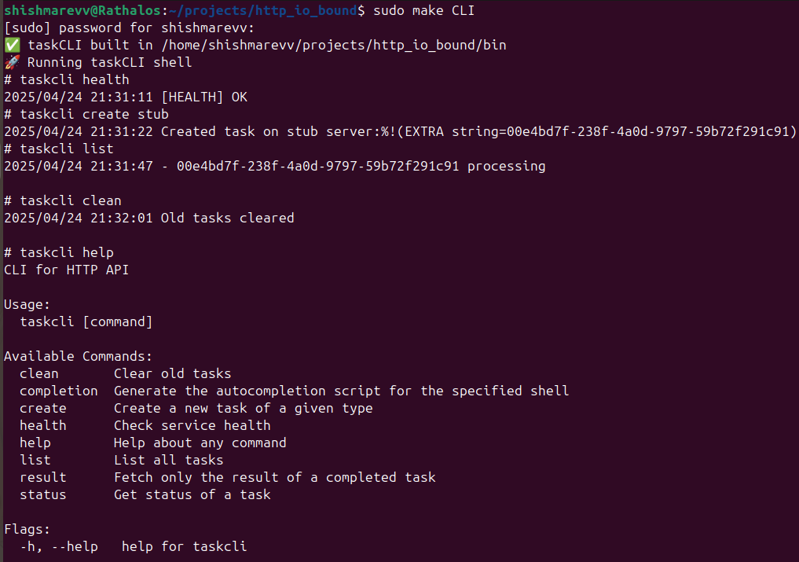
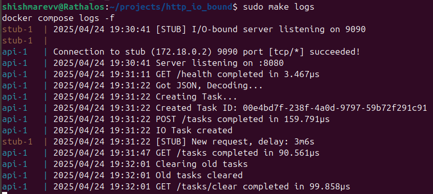

# I/O-Bound Task Manager HTTP API

A simple, extensible Go service that lets you enqueue and track long-running I/O-bound jobs (3–5 minutes) entirely in memory, without any external databases or message brokers.


## Features

🥂 Clean architecture

🍓 Standard Go-project layout

🌸 Easy to use commands

:whale: Docker, Docker-compose

:boom: Easy to expand

🤡 Stub server simulates I/O bound tasks

## Table of Contents
- [Features](#features)
- [Guide](#howto)
- [Expand task types](#add-new-task-type)
- [Usage](#usage)
- [License](#license)
- [Contact](#contact)

## HOWTO

Clone the project

```bash
git clone https://github.com/shishmarevv/http_io_bound
```

```bash
cd http_io_bound
```

### DOCKER

Build images
```bash
make build
```

Run
```bash
make up
```

Logs
```bash
make logs
```

Exit
```bash
make down
```

### Run locally
Install dependence
```bash
go mod download
```

Run API
```bash
make run-api
```

Run Stub-server
```bash
make run-stub
```

### Use commands (CLI)

Open shell
```bash
make CLI
```

Use taskcli [command]
```bash
taskcli help
```

## Run tests

To run tests, write following
```bash
go test -v ./...
```

## Add new Task type

### Edit handler
internal/web/handlers.go
```go
func (handler *Handler) CreateTask(writer http.ResponseWriter, request *http.Request) {
	errlog.Post("Got JSON, Decoding...")
	var taskrequest TaskRequest
	if err := json.NewDecoder(request.Body).Decode(&taskrequest); err != nil {
		errlog.HTTPCheck(writer, "invalid JSON payload", http.StatusBadRequest)
		return
	}

	errlog.Post("Creating Task...")
	var fn func(context.Context) (string, error)
	switch taskrequest.Type {
	case "stub":
		fn = task.IoTask
		
	//INSERT NEW TYPE AND ITS LOGIC HERE
		
	default:
		errlog.HTTPCheck(writer, "unknown task type", http.StatusBadRequest)
		return
	}

	id := handler.Manager.CreateTask(fn)
	errlog.Post(fmt.Sprintf("Created Task ID: %s", id))

	writer.Header().Set("Location", "/tasks/"+id)
	writer.WriteHeader(http.StatusAccepted)
}
```

### CLI
- Add new .go file to cmd/taskcli/create
- cmd/taskcli/create/create.go
```go
func init() {
	Cmd.AddCommand(
		stub, //INSERT NEW TYPE
	)
}
```

## Usage





## LICENSE
[MIT](https://choosealicense.com/licenses/mit/)

## Contact

Author: Viktor Shishmarev

Github: [@shishmarevv](https://github.com/shishmarevv)

LinkedIn: [shishmarevv](https://www.linkedin.com/in/shishmarevv/) 